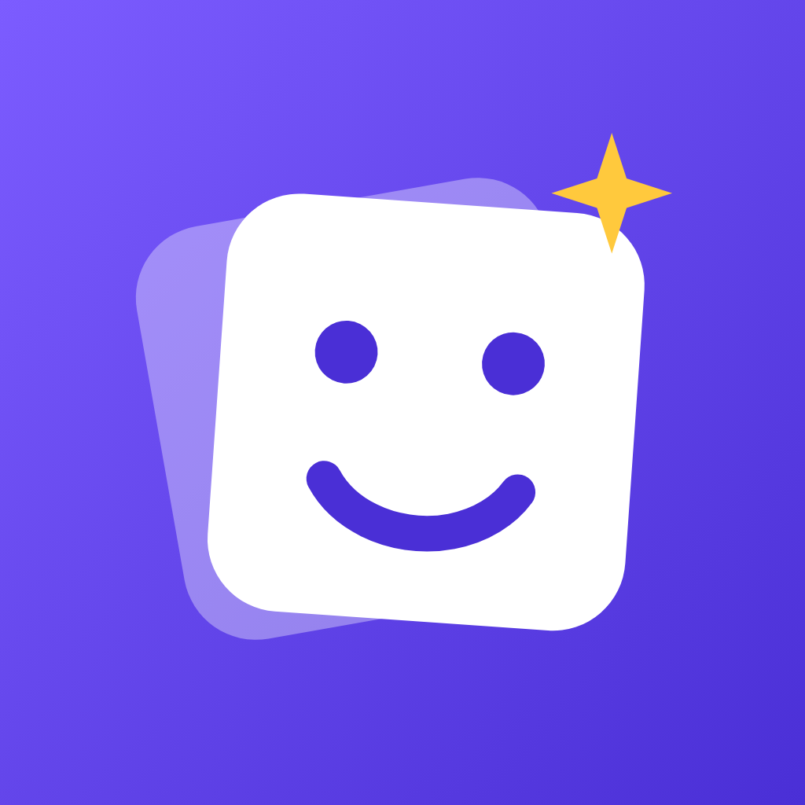
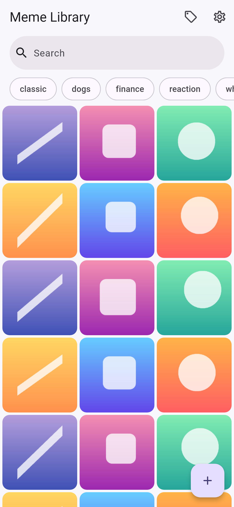
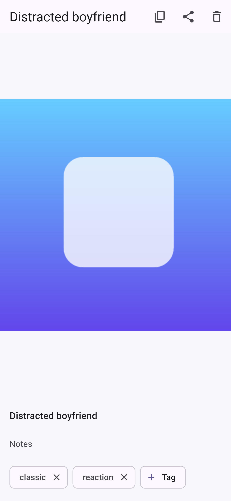
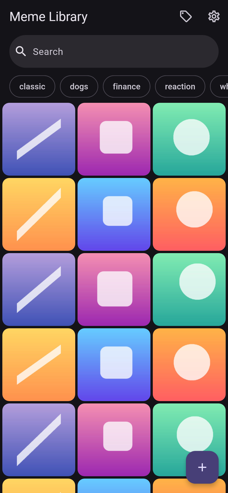

<div align="center">



# Meme Library

**Your meme stash, on your phone, nowhere else.**

Save memes from your clipboard, other apps, or links — then find the
right one in seconds and drop it into any conversation.

[](https://github.com/zkwokleung/meme-library/actions/workflows/ci.yml)
[](https://github.com/zkwokleung/meme-library/releases)


<br/>

| Library | Details | Dark mode |
| :-: | :-: | :-: |
|  |  |  |

</div>

## Features

- **Save from anywhere** — paste an image, drop in a link, or share
  straight into the app from any other app.
- **Find it fast** — full-text search over titles, notes, and tags,
  tuned to answer in under 150 ms on a 10,000-meme library.
- **Organize with tags** — filter chips, combined filters, and safe
  tag management with case-insensitive uniqueness.
- **Reuse instantly** — copy an image to the clipboard or share it to
  any app; WebP converts automatically where pasting needs PNG.
- **Never import twice** — content-hash deduplication resolves repeats
  to the meme you already have.
- **Own your data** — everything stays on device. One-tap versioned,
  checksum-verified backups; restores are transactional and can't
  corrupt your library, even if interrupted.

## Privacy

Local-first by design: no accounts, no analytics, no telemetry. The
only network request the app ever makes is downloading an image from a
link you typed yourself. Details in [docs/privacy.md](docs/privacy.md).

## Install

Grab the latest APK from
[Releases](https://github.com/zkwokleung/meme-library/releases), or
build from source:

```sh
flutter pub get
flutter build apk --release        # Android
flutter build ios --release        # iOS (requires Xcode + signing)
```

Receiving shares on iOS needs a one-time Share Extension setup in
Xcode: [docs/ios-share-extension.md](docs/ios-share-extension.md).

## Development

```sh
flutter test                                 # full suite (100+ tests)
dart run build_runner build                  # regenerate Drift code
flutter test tool/generate_icon.dart         # regenerate the app icon
flutter test tool/generate_screenshots.dart  # regenerate README screenshots
```

The architecture is a thin Material 3 UI over Riverpod providers, with
every platform capability behind a service boundary so the whole stack
is testable without a device:

```
lib/src/
  domain/     immutable models (Meme, Tag, LibraryQuery)
  data/       Drift database (FTS5), hash-keyed media store, repository
  import/     one validated import pipeline for clipboard, URL, shares
  backup/     streaming ZIP export + transactional restore
  features/   library grid, detail, tags, settings (Riverpod)
  services/   platform boundaries: clipboard, share, incoming shares
```

Releases are automated: pushing a `v*` tag builds and publishes the
Android APK/AAB and an unsigned iOS archive — see
[docs/release-checklist.md](docs/release-checklist.md).
